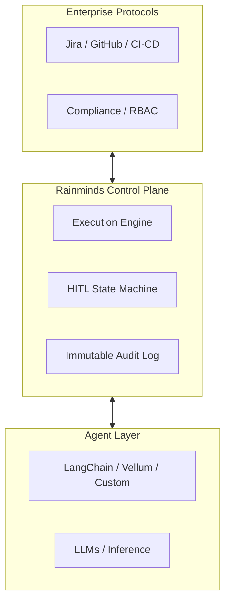

# Rainminds

> **The AI Execution Control Plane**

[Mission](#-mission) • [Projects](#-projects) • [Community](#-community--standards) • [Contact](mailto:abhishek@rainminds.com)

---

## 🚀 Mission

**Enterprises are moving from “Building Agents” to “Governing Agent Fleets.”**

The current stack is fragmented. Teams build AI agents using powerful frameworks, but lack a **shared execution, control, and accountability layer** when those agents run inside real enterprise processes.

We are building the **AI Execution Control Plane** that sits:
- **above** agent frameworks (LangChain, Vellum, CrewAI, custom),
- **below** enterprise processes and compliance policies.

Think of **Rainminds** as **Kubernetes for AI execution semantics** —  
with **Human-in-the-Loop (HITL) as a first-class control primitive**.

We standardize how AI workflows:
- execute,
- pause for human authority,
- escalate risk,
- and prove accountability.

---

## ❗ What We Build (and What We Don’t)

Rainminds builds and stewards two tightly-coupled projects:

- **Gantral** — the open-source AI execution control plane
- **Gantrio** — the managed enterprise platform built on top of Gantral

### Gantral IS
- An AI execution control plane
- A system of record for AI + human decisions
- Infrastructure for Human-in-the-Loop (HITL), policy enforcement, and auditability
- Framework-agnostic and vendor-neutral

### Gantral IS NOT
- An agent builder
- An autonomous AI platform
- A CI/CD or workflow engine replacement
- A system that allows AI to bypass human authority

---

## 🛡️ Compliance & Risk Outcomes

We designed the Rainminds control plane to satisfy strict regulatory frameworks out of the box. Implementation directly supports compliance with:

| Standard | Outcome via Rainminds |
| :--- | :--- |
| **EU AI Act (Art. 14)** | **Human Oversight:** Mechanical guarantee that high-risk agents cannot execute without human state transition (`WAITING_FOR_HUMAN`). |
| **NIST AI RMF** | **Governance:** Policy-as-code ensures legal/risk requirements are enforced physically at the infrastructure layer. |
| **Banking (SR 11-7)** | **Effective Challenge:** Immutable logs capture *why* humans rejected/overrode AI, creating the feedback loop required by model risk auditors. |
| **SOC 2 Type II** | **Auditability:** Tamper-evident execution ledgers prove exactly who approved what, and when. |

---

## 🛠 Projects

### 🟢 [Gantral](https://github.com/Rainminds/gantral) (Open Source)
**Status: In Development (Private Beta)**  
*The Standard for Safe AI Execution.*

Just as  **Istio** manages traffic between microservices, **Gantral** manages **risk and authority** between AI agents and humans.

**Core ideas:**
- Control, not autonomy
- Determinism over cleverness
- Auditability before optimization

**Key capabilities:**

- **Instance-First Execution Model (Core Differentiator):**  
  Every policy, approval, cost, and audit trail attaches to a **specific execution instance** — not a shared agent. This guarantees isolation, replayability, and accountability across teams.

- **Deterministic State Machine:**  
  HITL is a first-class state transition. Agents don’t just “stop”; they enter a `WAITING_FOR_HUMAN` state that is auditable, secure, and resumable.

- **Policy-as-Code:**  
  Define materiality and authority rules (e.g. “Always require approval for prod DB writes” or “Escalate transactions > $50”) using declarative YAML/JSON.

🔜 **Public repo launching Q1 2026**  
📩 [Request Early Access](mailto:abhishek@rainminds.com?subject=Gantral%20Early%20Access)

---

### 🔵 Gantrio (Enterprise)
**Status: Design-Partner Phase**  
*The Control Plane for Regulated Industries.*

Gantrio is the managed, enterprise-grade platform built on top of Gantral.

It provides the operational surface area enterprises need to **run AI safely at scale**, especially in regulated environments.

**Capabilities:**

- **Unified Audit Trail:**  
  Every agent action, human approval, and override is logged in a tamper-evident ledger (SOC2 / GDPR ready).

- **Cost & Token Governance:**  
  Fine-grained budgets and quotas enforced per **team and project**, not just per model.

- **RBAC & Governance:**  
  Granular permissions for human-agent collaboration, approvals, and escalation paths.

---

## 🧩 Where Rainminds Fits

- **Below** agent builders (LangChain, Vellum, CrewAI)
- **Above** enterprise tools (GitHub, Jira, CI/CD, ServiceNow)
- **Alongside** compliance, risk, and governance systems

---

## 🤝 Community & Standards

We believe in **“Listen, Then Lead.”**

We are aligning our specifications with the **CNCF TAG** to help define an open, vendor-neutral **Agent Governance Standard** before the ecosystem fragments.

---

## 📘 Executive Briefings (Optional Context)

For stakeholders evaluating Rainminds, Gantral, and Gantrio from an
enterprise, risk, or regulatory perspective, we maintain a short set of
executive briefings that explain:

- what the system is,
- how work changes after adoption,
- how it scales across teams,
- and why it stands up to regulatory scrutiny.

These materials are **not required** to understand or contribute to the
open-source project, but are useful contexts for enterprise discussions.

- [Gantral & Gantrio — Executive Overview](https://youtu.be/WEbsdmBWkRI)
- [What Changes After Adoption](https://youtu.be/g59alKYgF2Y)
- [The AI Execution Plane](https://youtu.be/Iqsmg5ipRTY)
- [Regulatory & Compliance Outcomes](https://youtu.be/vwPRMOoXW9o)

---

> *We don’t help you build agents.  
> We help you run AI safely across your organization.*

---

  Built by the Rainminds team. 
  © 2025 Rainminds Solutions Private Limited.

