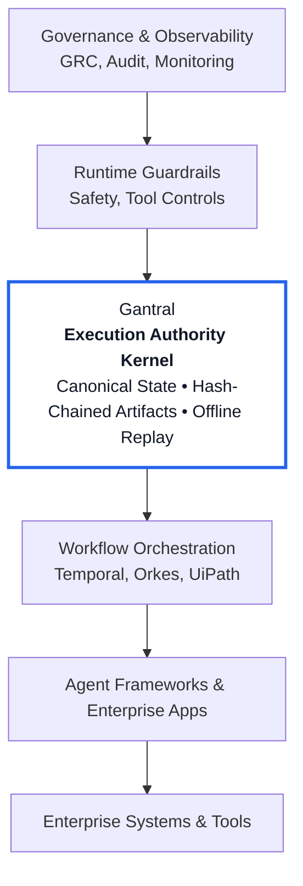

# Rainminds

> **Execution Authority Infrastructure for Enterprise Agentic AI**  
> Provable execution authority — enforced at runtime, independent of logs.

[Mission](#-mission) • [Gantral](#-gantral) • [Gantrio](#-gantrio) • [When It Is Necessary](#-when-structural-authority-is-necessary) • [Architecture](#-architectural-separation) • [Research](#-research--specification) • [Community](#-community--contact)

---

## 🚀 Mission

AI systems are no longer experiments.

They are embedded inside:

- Financial workflows  
- Infrastructure automation  
- Security operations  
- Healthcare decisions  
- Government systems  

AI can act.  
Humans remain accountable.

Yet in most enterprise systems, **execution authority remains implicit**.

Today’s stacks can:

- Orchestrate workflows  
- Apply guardrails  
- Log events  
- Produce dashboards  

Very few systems structurally enforce:

- When execution must pause  
- Who is authorized to proceed  
- Whether approval and execution are inseparable  
- Whether the decision can be independently replayed later  

Rainminds builds the missing layer.

We do not focus on how agents reason.

We focus on whether AI-driven execution is **admissible — deterministically, transparently, and replayably.**

---

# 🟢 Gantral

> **Execution Authority Infrastructure for Agentic AI**  
> Authority as deterministic state — not as a log.

Gantral is an open-source **Execution Authority Kernel**.

It introduces canonical authority semantics into orchestrated AI systems and ensures that high-consequence execution is structurally defensible.

Gantral governs authority.  
It does not replace orchestration.

---

## The Structural Gap

Modern enterprise stacks include:

- Agent & Tool Layer  
- Workflow Orchestration (Temporal, Orkes, UiPath, Step Functions, etc.)  
- Runtime Guardrails  
- Observability & GRC  

These layers are powerful.

But they assume:

- Authority can be reconstructed from logs  
- Human-in-the-loop tasks are sufficient  
- Auditability equals admissibility  

That assumption fails under adversarial scrutiny.

---

## What Gantral Enforces

Gantral introduces:

- Canonical authority state machine  
- `WAITING_FOR_HUMAN` as blocking state  
- Explicit `APPROVED / REJECTED / OVERRIDDEN` transitions  
- Atomic state transition + artifact emission  
- Cryptographic hash chaining  
- Workflow + policy version binding  
- Log-independent replay  
- Fail-closed semantics  

Authority transitions emit commitment artifacts binding:

- `workflow_version_id`
- `policy_version_id`
- `human_actor_id`
- `context_snapshot_hash`
- Justification metadata
- Recursive hash pointer

Replay requires no runtime, database, or log access.

Audit logs reconstruct.  
Gantral proves.

---

## Deterministic Authority Model

Canonical authority state progression:

```

CREATED → RUNNING → WAITING_FOR_HUMAN
→ APPROVED / REJECTED / OVERRIDDEN
→ RESUMED → COMPLETED / TERMINATED

```

Transitions are:

- Atomic  
- Identity-validated  
- Append-only  
- Cryptographically chained  
- Replay-verifiable  

Gantral is constitutionally unintelligent.

It does not interpret business logic.  
It enforces authority invariants.

---

## What Gantral Is NOT

Gantral is not:

- An AI governance dashboard  
- A GRC tool  
- A compliance reporting platform  
- A workflow engine  
- A guardrail framework  
- A model monitoring system  
- An agent builder  

It is:

Execution Authority Infrastructure.

---

# 🔵 Gantrio

> **Execution Authority Platform for Production Systems**  
> Authority lifecycle management and operational hardening.

Gantrio extends Gantral into an enterprise authority management platform.

If Gantral is the constitutional kernel, Gantrio is the management plane.

Gantrio provides:

- Policy lifecycle management  
- Authority analytics  
- Replay packaging for regulators  
- Multi-tenant governance  
- Upgrade compatibility validation  
- Environment segmentation (dev / staging / prod)  
- Enterprise hardening  

Gantrio does not replace orchestration.  
Gantrio does not replace GRC dashboards.  

Gantral remains open-source and independently usable.

---

# ⚖ When Structural Authority Is Necessary

Gantral is not required for every workflow.

Orchestration alone is often sufficient for:

- Internal HR approvals  
- Low-value vendor invoices  
- Routine automation  

Structural authority becomes rational infrastructure when:

- Financial exposure exceeds material thresholds  
- Regulatory enforcement is plausible  
- Litigation risk exists  
- Board-level explanation may be required  
- Decisions could be challenged years later  

If this decision appeared in litigation two years from now,  
could you independently prove that authority was exercised correctly?

If that answer depends on logs and reconstruction,  
structural authority may be warranted.

---

## Representative High-Materiality Use Cases

Across industries:

### Financial Services
- Large funds transfer release  
- AI underwriting override  
- AML alert clearance  
- Trading kill-switch override  

### Healthcare
- AI treatment override  
- High-risk drug authorization  
- Clinical eligibility approval  

### Enterprise IT & Security
- AI-assisted production deployment  
- Break-glass privileged access  
- Security rule override  

### Government
- Benefits eligibility override  
- Procurement approval  
- Permit issuance override  

Gantral is for workflows where:

- Money moves  
- Access escalates  
- Infrastructure changes  
- Regulatory exposure exists  

Orchestration ensures correct execution.  
Gantral ensures defensible execution.

---

# 🧱 Architectural Separation

Enterprise Agentic Stack:

- Orchestration coordinates tasks  
- Guardrails filter actions  
- Observability monitors systems  
- Gantral governs authority  
- Gantrio governs authority at scale  

Gantral sits:

- Below guardrails  
- Above orchestration  
- Between agent frameworks and workflow runtimes  


```mermaid
flowchart TB


   GRC[Governance & Observability<br/> GRC, Audit, Monitoring]
   Guardrails[Runtime Guardrails<br/> Safety, Tool Controls]
   Gantral[Gantral<br/><b>Execution Authority Kernel</b><br/>Canonical State • Hash-Chained Artifacts • Offline Replay]
   Orchestration[Workflow Orchestration<br/> Temporal, Orkes, UiPath]
   Agents[Agent Frameworks & Enterprise Apps]
   Tools[Enterprise Systems & Tools]


   GRC --> Guardrails --> Gantral --> Orchestration --> Agents --> Tools


   style Gantral fill:#ffffff,stroke:#2563eb,stroke-width:3px,color:#111827
```

It does not observe.  
It does not report.  
It enforces.

Architecture aligns with the layered model defined in our product architecture.

---

# 📄 Research & Specification

Gantral is grounded in formal research:

- Execution Authority as a missing infrastructure layer  
- Admissible execution invariants  
- Deterministic replay semantics  
- Version-bound authority transitions  

The formal specification defines:

- Canonical state set  
- Transition relation  
- Artifact schema  
- Replay protocol  
- Conformance criteria  

Gantral is the reference implementation of that specification.

→ https://gantral.org/papers

---

# 🛠 Projects

## 🟢 Gantral — Open Source

Execution authority kernel.

- Apache 2.0  
- Self-hosted  
- Deterministic  
- Framework-agnostic  
- Replay-verifiable  

## 🔵 Gantrio — Enterprise Platform

Authority lifecycle & management plane.

- Managed authority clusters  
- Policy lifecycle tooling  
- Authority intelligence  
- Replay packaging  
- Enterprise SLAs  

Gantral remains independent.  
Gantrio depends on Gantral — never the reverse.

---

# 🧠 Core Principle

Modern AI systems must separate:

**Intelligence**  
(reasoning, planning, tool use)

from

**Authority**  
(whether execution may proceed)

Intelligence evolves.  
Authority must remain structurally verifiable.

Authority must be:

- Deterministic  
- Version-bound  
- Identity-bound  
- Cryptographically committed  
- Log-independent  
- Replayable  

---

# 🤝 Community & Contact

Rainminds is building vendor-neutral execution authority infrastructure.

We engage:

- Platform engineering leaders  
- Regulated enterprises  
- Orchestration ecosystems  
- Security and compliance architects  

Execution authority should be infrastructure — not convention.

📩 Contact: abhishek@rainminds.com  
🌐 https://gantral.org  

---

> We don’t help teams build agents.  
> We help organizations run agentic AI deterministically.

© 2025 Rainminds Solutions Private Limited
