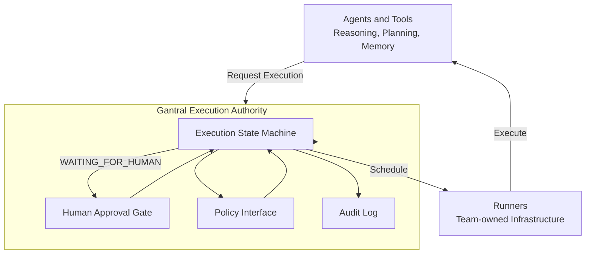

# Rainminds

> **Building the AI Execution Control Plane**

[Mission](#-mission) • [Projects](#-projects) • [Governance Problem](#-the-enterprise-governance-crisis) • [Community](#-community--standards) • [Contact](mailto:abhishek@rainminds.com)

---

## 🚀 Mission

**Enterprises are moving from “building agents” to “governing agent fleets.”**

AI adoption is accelerating, but governance is breaking.

Teams build powerful agents using modern frameworks, yet lack a **shared execution, control, and accountability layer** once those agents operate inside real enterprise systems.

Rainminds is the company building infrastructure to solve this problem.

We build products that standardize **how AI-driven actions are allowed to run** — not how agents think.

At the core of this effort is **Gantral**.

---

## 🧠 What Is Gantral?

Gantral is an **open-source AI Execution Control Plane**.

It standardizes how AI-enabled workflows are **executed, paused, escalated, approved, overridden, and audited** across teams and systems.

Gantral exists to solve a specific enterprise problem:

> **AI adoption breaks execution control and accountability — not just model quality.**

As AI tools spread across the software development lifecycle (SDLC) and operational workflows, organizations lose consistent answers to fundamental questions:

- What ran?
- Under whose authority?
- With what configuration?
- What human approved or overrode the outcome?
- Can this decision be replayed and audited?

Gantral provides **infrastructure-level guarantees** to record and surface these answers.

---

## 📄 Position Paper

Rainminds publishes a **vendor-neutral position paper** defining the **AI Execution Control Plane** as a missing infrastructure layer for execution-time governance in AI-assisted systems.

These documents are **not product documentation**.  
They define the problem space, execution semantics, and accountability model independent of any specific implementation.

- **AI Execution Control Plane — Executive Summary**  
  A concise overview for platform leaders, architects, and decision-makers.  
  → https://gantral.org/papers

- **AI Execution Control Plane — Position Paper**  
  The full, non-normative paper covering execution authority, determinism, and auditability.  
  → https://gantral.org/papers

---

## ⚖️ The Core Idea: Authority vs. Intelligence

Gantral introduces a **shared execution plane** that separates **Authority** from **Reasoning**.

- **Agents** (CrewAI, LangGraph, custom) provide the *intelligence*: planning, reasoning, tool use, and memory.
- **Gantral** provides the *authority*: deciding whether execution may proceed, pausing for human input, enforcing outcomes, and recording decisions.

This separation prevents AI-driven execution from advancing past governed states without explicit authorization.

Think of **Gantral** as **Kubernetes for AI execution semantics** —  
with **Human-in-the-Loop (HITL)** as a first-class control primitive.

---

## 🏃 How Gantral Works (Federated Runner Model)

Gantral does **not** host or run your agents like a PaaS.

It uses a **Federated Runner model**, similar in spirit to GitHub Actions:

1. **Agents** run in your own infrastructure (Kubernetes, VMs, serverless).
2. **Runners** pull execution tasks from Gantral.
3. **Gantral** enforces execution authority and policy gates.
4. If human input is required, execution transitions to `WAITING_FOR_HUMAN`.
5. The agent process exits cleanly (zero CPU usage).
6. After approval or override, Gantral reschedules execution and a new agent process resumes work.

Gantral is the **authority layer**.  
Runners are **executors**.  
Agent state remains **framework-owned**.

---

## 🚨 The Enterprise Governance Crisis

Large organizations face two structural failures when scaling AI:  
**Operational Fragmentation** and **Broken Chain of Custody**.

---

### 1. Operational Fragmentation  
*(The “Shadow Runbook” Problem)*

Without a shared execution control plane, critical decision logic gets buried inside agent prompts and scripts.

- **Hidden Logic**  
  Business-critical rules (e.g. *“Only restart DB if latency > 5s”*) live in natural-language prompts or agent code, creating *shadow runbooks* that platform and compliance teams cannot audit, version, or update.

- **Siloed Implementations**  
  Each team reinvents safety checks, approval logic, and escalation paths, leading to inconsistent enforcement of organizational policy.

**Gantral decouples decision criteria from agent prompts.**  
It lets platform teams enforce deterministic, centrally governed policy on top of probabilistic agents — without rewriting agent logic.

---

### 2. Broken Chain of Custody  
*(The “Disconnected Evidence” Problem)*

Even when humans are involved, the link between **facts** and **approvals** is often broken.

- **The Self-Reporting Fallacy**  
  Agents summarize logs or metrics for humans. These summaries can be incomplete or wrong. Humans approve based on the agent’s narrative, and the audit trail looks “valid” for an invalid justification.

- **The Air Gap**  
  An agent recommends an action, and a human executes it manually in a separate system. There is no durable link between the context at approval time and the action taken.

**Gantral acts as the execution anchor layer.**

It binds:
- execution context references at time of decision  
- the human approval or override  
- the enforced execution outcome  

into a **single, immutable execution record**.

Gantral does not interpret evidence or tool payloads.  
It ensures that **no governed action proceeds without a recorded, attributable human decision tied to the exact execution context that justified it**.

---

## 🧩 Conceptual Architecture

```mermaid
flowchart TB
    DEV["Agents and Tools
Reasoning, Planning, Memory"]

    subgraph G["Gantral Execution Authority"]
        SM["Execution State Machine"]
        HITL["Human Approval Gate"]
        POL["Policy Interface"]
        AUD["Audit Log"]
    end

    RUN["Runners
Team-owned Infrastructure"]

    DEV -->|Request Execution| G
    G --> SM
    SM --> POL
    POL --> SM
    SM -->|WAITING_FOR_HUMAN| HITL
    HITL --> SM
    SM -->|Schedule| RUN
    RUN -->|Execute| DEV
    SM --> AUD
```

---

## 🧱 What Gantral Owns (and Does Not)

Gantral owns **execution semantics**, not agent intelligence.

### Gantral provides

* Deterministic execution state machine
* HITL as a blocking state transition
* Instance-level isolation for audit and accountability
* Declarative control via pluggable policy interfaces
* Immutable execution records with deterministic replay

### Gantral explicitly does not

* Store or manage agent memory
* Inspect or reason over tool payloads
* Author business logic
* Make autonomous decisions
* Optimize or route models

Gantral is intentionally **boring, predictable, and auditable**.

---

## 🛠 Projects

### 🟢 Gantral — Open Source

*The Standard for Safe AI Execution.*

An execution control plane that enforces authority, human oversight, and auditability for AI-driven actions.

### 🔵 Gantrio — Enterprise Platform

*The operational surface for Gantral.*

Gantrio provides the enterprise UX and managed capabilities required to operate Gantral at scale in regulated environments.

Rainminds currently builds **Gantral** and **Gantrio**, and may build additional products in the future.

---

## 🧩 Where Rainminds Fits

* **Below** agent builders and orchestration frameworks
* **Above** enterprise systems and workflows
* **Alongside** risk, compliance, and governance functions

Rainminds builds the infrastructure that lets these layers work together safely.

---

## 🤝 Community & Standards

We believe in **“listen, then lead.”**

Rainminds is engaging with the ecosystem to help shape **open, vendor-neutral standards for AI execution governance**, before fragmentation becomes irreversible.

---

> *We don’t help you build agents.*
> *We help you run AI safely across your organization.*

---

Built by the Rainminds team.
© 2025 Rainminds Solutions Private Limited.
